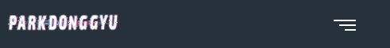
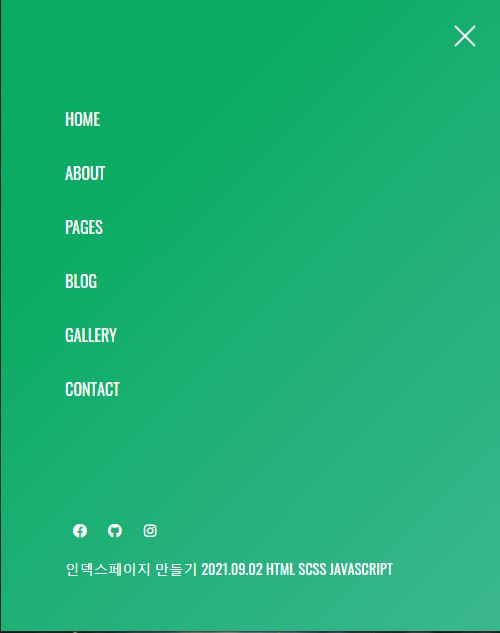
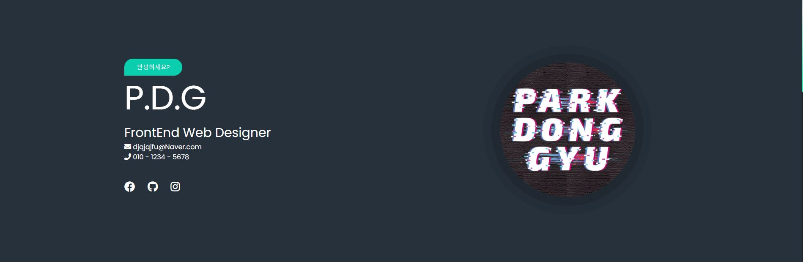
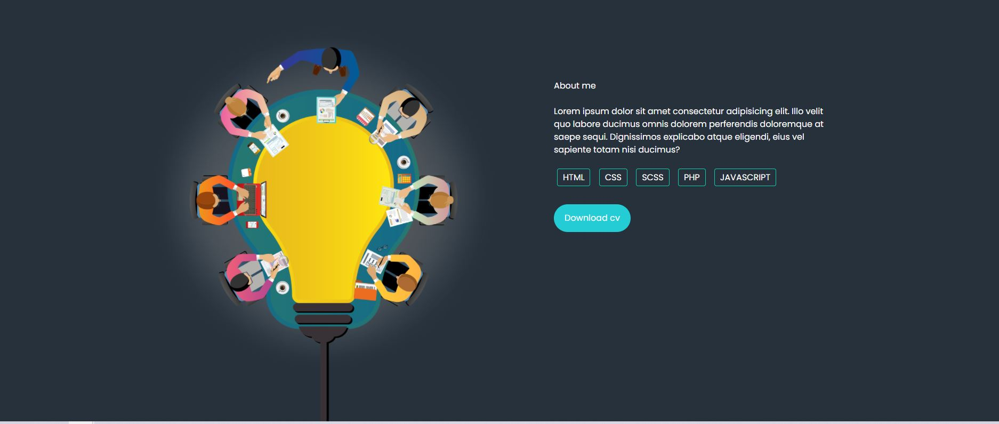
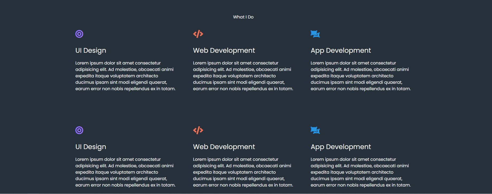

# indexPageSide01

## 2021.09.02 메인페이지 연습하기.

### 사용언어 :  HTML, SCSS, JAVASCRIPT

* 2021.09.02 1DAY 헤더부분 작성 완료

1. 상단 메뉴 스크롤시 고정 이벤트 발생.
2. 반응형 헤더로 제작
3. 미디어 쿼리를 이용하여 특정 크기시 상단 메뉴가 사라지고 버거메뉴가 나오게 만듬
4. 버거 메뉴 클릭시 메뉴가 펼쳐지는 이벤트 발생.

 
 
 

 - 1DAY END

--------------------------------------------------------------------------

* 2021.09.02 2DAY 메인부분 제작중

1. 폰트어썸을 이용하여 다양한 아이콘 삽입
2. 레이아웃 구성에 맞춰서 알맞게 콘텐츠 삽입
3. 스크롤바 커스텀
4. 반응형은 아직 제작하지 않음

 
 
 

- 2DAY END